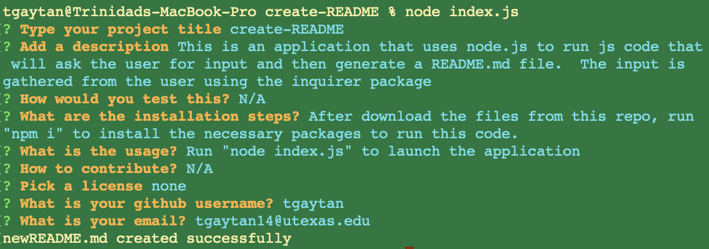

# create-README

## Description 

This is an application that uses node.js to run js code that will ask the user for input and then generate a README.md file.  The input is gathered from the user using the inquirer package.

This application helps to create a professional README file.  

## Installation

After downloading the files from this repo, run "npm i" to install the necessary packages to run this code.

## Usage

Run "node index.js" to launch the application.  Answer the prompts.  Here is a screenshot of the prompts

Below is a link to a video of the application running.

https://drive.google.com/file/d/1BxLZ5oX7BEBI-D55XGXz1MWxwYf1D8K7/view

## License

N/A